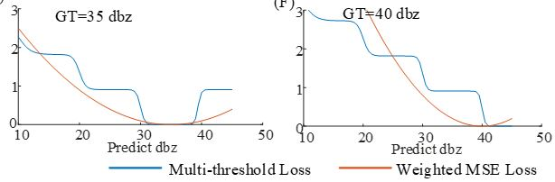

# MultithresholdLoss
STADEN: A Dual-Branch Deep Learning Framework with Multi-threshold Loss for Robust Radar Echo Extrapolation
STADEN Radar Echo Extrapolation Method is in the process of article review.

